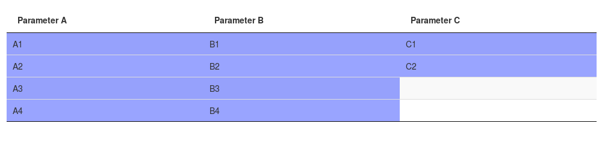
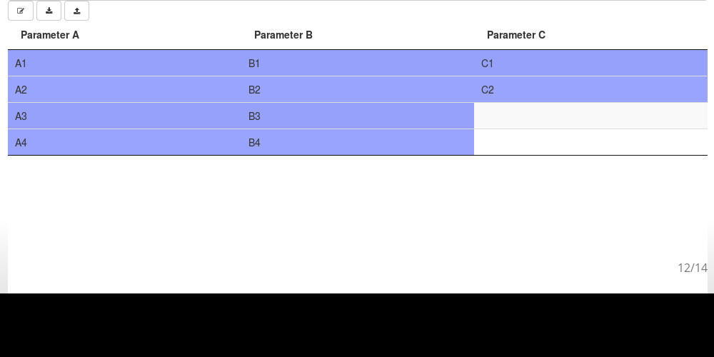
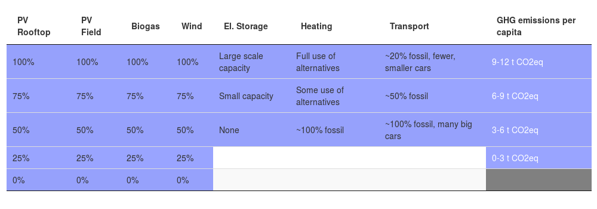

<!-- Load fonts -->
<link href="https://fonts.googleapis.com/css?family=Oswald|Open+Sans+Condensed:700|Raleway" rel="stylesheet">

## Morphological Analysis (MA)

### What is MA?

> * A qualitative modelling method for systematically structuring complex problems
> * Useful tool for scenario development
> * "Simply an ordered way of looking at things" (Fritz Zwicky, 1948,
    *Morphological astronomy*)
> * Very flexible and general, also called *General Morphological Analysis*

<!--
> * Holistic approach: "A method for structuring and investigating **the total set of
    relationships** contained in multi-dimensional, non-quantifiable, problem
    complexes" (Tom Ritchey, 2011, *Wicked Problems --- Social Messes*)

> * Use cases:
>   * From classifying astronomical objects via developing jet engines to
      investigating legal aspects of space colonization
-->

### What MA is not

> * Very specialized theory/method, e.g. in biology, geology, linguistics, ...
> * Mathematical morphology as used in image processing (CRAN packages `Morpho`
    and `mmand`)


<!--
## Why use MA?

* To tackle "wicked problems" (Ritchey, 2011)
* For "garbage detection"
    - Remove irrelevant variables
    - Remove inconsistent relations
* For interactive visualization of a (qualitative) model

* Wicked problems are:
    - Complex and messy (multi-dimensional)
    - Difficult to define (ambiguous)
    - Changing all the time
    - Everything depends on everything else
    - "*Society*", "*people*"
    - Non-quantifiable $\rightarrow$ mathematical modelling/simulation useless
-->


## Some credits

<div style="float: right; width: 300px; margin-left: 25px;">
  
  <span style="font-size: 12pt;">
  Fritz Zwicky (Source: <a style="font-size: 12pt;" href="https://www.flickr.com/photos/kevandotorg/2426466260/in/photolist-pM1yzJ-4GqgTb-5KRWpv">Kevan: Spherical Bastard</a>,
  <a style="font-size: 12pt;" href="https://creativecommons.org/licenses/by-nc/2.0/">CC BY-NC 2.0</a>, modified)
  </span>
</div>

* MA originally developed by Swiss astrophysicist Fritz Zwicky from
  1940s to 1970s (Fritz Zwicky, 1948, *Morphological astronomy*)

* Adopted by *Swedish Morphological Society*
  (Tom Ritchey, 2011, *Wicked Problems --- Social Messes*; http://www.swemorph.com/)
    - Full-featured software MA/Carma™ developed since 1990s
    - Use it in consultancy work
    - Workshops with a team of subject matter experts


## The morphological field

* A tabular display of multi-dimensional problem space
* Each *column* is one *parameter*
* Each column's *rows* list the possible values of the parameter
* Parameters are by definition categorical

```{r, echo=FALSE}
data <- morphr::paramValuesToDataFrame(list(
  "Parameter A" = c("A1", "A2", "A3", "A4"),
  "Parameter B" = c("B1", "B2", "B3"),
  "Parameter C" = c("C1", "C2", "C3", "C4"),
  "Parameter D" = c("D1", "D2")
))
knitr::kable(data)
```

<!--

 | table | column |
 |-------|--------|
 | 1     | 2      |

-->


## The cross-consistency matrix (CCM)

* Each paramater value is checked pairwise for consistency with all values of
  all other parameters
* Results put into half-sided matrix (e.g. lower triangle)
* With CCM, many combinations of paramater values can be excluded as inconsistent</br>
  $\rightarrow$ reduces size of problem space
* Advantage: don't need to check all configurations:
  $$\prod_{i=1}^N n_i,$$
  but only value pairs:
  $$\sum_{i=1}^{N-1} \sum_{j=i+1}^N n_i n_j.$$

## {.smaller}

<table class="rmdtable">
<thead>
<tr>
<td colspan="2" rowspan="2" class="off"></th>
<th colspan="4" class="header-span">Parameter A</th>
<th colspan="3" class="header-span">Parameter B</th>
<th colspan="4" class="header-span">Parameter C</th>
</tr>
<tr>
<th class="header">A1</th>
<th class="header">A2</th>
<th class="header">A3</th>
<th class="header">A4</th>
<th class="header">B1</th>
<th class="header">B2</th>
<th class="header">B3</th>
<th class="header">C1</th>
<th class="header">C2</th>
<th class="header">C3</th>
<th class="header">C4</th>
</tr>
</thead>
<tbody>
<tr>
<td rowspan="3" class="header-span">Parameter B</td>
<td class="header">B1</td>
<td class="dark">&#x2713;</td>
<td class="dark">&#x2713;</td>
<td class="dark"></td>
<td class="dark"></td>
<td class="off"></td>
<td class="off"></td>
<td class="off"></td>
<td class="off"></td>
<td class="off"></td>
<td class="off"></td>
<td class="off"></td>
</tr>
<tr>
<td class="header">B2</td>
<td class="dark"></td>
<td class="dark">&#x2713;</td>
<td class="dark">&#x2713;</td>
<td class="dark"></td>
<td class="off"></td>
<td class="off"></td>
<td class="off"></td>
<td class="off"></td>
<td class="off"></td>
<td class="off"></td>
<td class="off"></td>
</tr>
<tr>
<td class="header">B3</td>
<td class="dark"></td>
<td class="dark"></td>
<td class="dark">&#x2713;</td>
<td class="dark">&#x2713;</td>
<td class="off"></td>
<td class="off"></td>
<td class="off"></td>
<td class="off"></td>
<td class="off"></td>
<td class="off"></td>
<td class="off"></td>
</tr>
<tr>
<td rowspan="4" class="header-span">Parameter C</td>
<td class="header">C1</td>
<td class="light"></td>
<td class="light">&#x2713;</td>
<td class="light">&#x2713;</td>
<td class="light"></td>
<td class="dark"></td>
<td class="dark"></td>
<td class="dark">&#x2713;</td>
<td class="off"></td>
<td class="off"></td>
<td class="off"></td>
<td class="off"></td>
</tr>
<tr>
<td class="header">C2</td>
<td class="light">&#x2713;</td>
<td class="light">&#x2713;</td>
<td class="light">&#x2713;</td>
<td class="light">&#x2713;</td>
<td class="dark">&#x2713;</td>
<td class="dark">&#x2713;</td>
<td class="dark"></td>
<td class="off"></td>
<td class="off"></td>
<td class="off"></td>
<td class="off"></td>
</tr>
<tr>
<td class="header">C3</td>
<td class="light">&#x2713;</td>
<td class="light">&#x2713;</td>
<td class="light">&#x2713;</td>
<td class="light"></td>
<td class="dark"></td>
<td class="dark">&#x2713;</td>
<td class="dark">&#x2713;</td>
<td class="off"></td>
<td class="off"></td>
<td class="off"></td>
<td class="off"></td>
</tr>
<tr>
<td class="header">C4</td>
<td class="light">&#x2713;</td>
<td class="light">&#x2713;</td>
<td class="light"></td>
<td class="light"></td>
<td class="dark">&#x2713;</td>
<td class="dark">&#x2713;</td>
<td class="dark"></td>
<td class="off"></td>
<td class="off"></td>
<td class="off"></td>
<td class="off"></td>
</tr>
<tr>
<td rowspan="2" class="header-span">Parameter D</td>
<td class="header">D1</td>
<td class="dark"></td>
<td class="dark">&#x2713;</td>
<td class="dark">&#x2713;</td>
<td class="dark">&#x2713;</td>
<td class="light">&#x2713;</td>
<td class="light">&#x2713;</td>
<td class="light"></td>
<td class="dark">&#x2713;</td>
<td class="dark"></td>
<td class="dark"></td>
<td class="dark"></td>
</tr>
<tr>
<td class="header">D2</td>
<td class="dark">&#x2713;</td>
<td class="dark"></td>
<td class="dark"></td>
<td class="dark"></td>
<td class="light"></td>
<td class="light"></td>
<td class="light">&#x2713;</td>
<td class="dark"></td>
<td class="dark">&#x2713;</td>
<td class="dark">&#x2713;</td>
<td class="dark">&#x2713;</td>
</tr>
</tbody>
</table>


## The R package `morphr`

* Goals:
    - Make MA accessible in R
    - Make MA software platform-independent and open source
    - Allow use of MA on the web (e.g. for distributed teams)
* Implementation:
    - Based on RStudio's `DT` package (fork), i.e. `htmlwidget` jQuery plugin *DataTables*
    - Using Shiny to provide interactivity
    - A morphological field is installed using function `installMorphField()`


## Installation

Install from github using `devtools`:

```{r eval=FALSE}
devtools::install_github("sgrubsmyon/morphr")
```


## Example usage

```{r include=FALSE, cache=FALSE}
library(morphr)
```

```{r}
param_values <- list("Parameter A" = c("A1", "A2", "A3", "A4"),
                     "Parameter B" = c("B1", "B2", "B3", "B4"),
                     "Parameter C" = c("C1", "C2"))

configurations <- list(list(list(param = "Parameter A", value = "A1"),
                            list(param = "Parameter B", value = c("B2", "B3")),
                            list(param = "Parameter C", value = "C1")),
                       list(list(param = "Parameter A", value = "A2"),
                            list(param = "Parameter B", value = "B4"),
                            list(param = "Parameter C", value = "C2")),
                       list(list(param = "Parameter A", value = "A3"),
                            list(param = "Parameter B", value = "B1"),
                            list(param = "Parameter C", value = "C1")),
                       list(list(param = "Parameter A", value = "A4"),
                            list(param = "Parameter B", value = "B3"),
                            list(param = "Parameter C", value = "C2")))
```

## Example usage

```{r, eval=FALSE}
library(shiny)
shinyApp(
  ui = fluidPage(
    fluidRow(morphr::morphFieldOutput("morphfield"))
  ),
  server = function(input, output, session) {
    morphr::installMorphField(input, output, id = "morphfield",
                              param_values = param_values,
                              configurations = configurations)
  }
)
```

## Example usage



## An editable field

```{r, eval=FALSE}
morphr::installMorphField(input, output, id = "morphfield",
                          param_values = param_values,
                          configurations = configurations,
                          editable = TRUE)
```



## More complex example (made up)



## Outlook

* `morphr` package still in early stage
    - Started in mid-February this year
    - Editing functionality added in June
    - Still missing: view and edit the CCM itself
* Hopefully, someone finds this helpful
    - As new visualization method
    - For structuring problems
* Code is on https://github.com/sgrubsmyon/morphr
* Slides repo: https://github.com/sgrubsmyon/morphr-talk-user2017
* Feel free to contribute, ask questions
